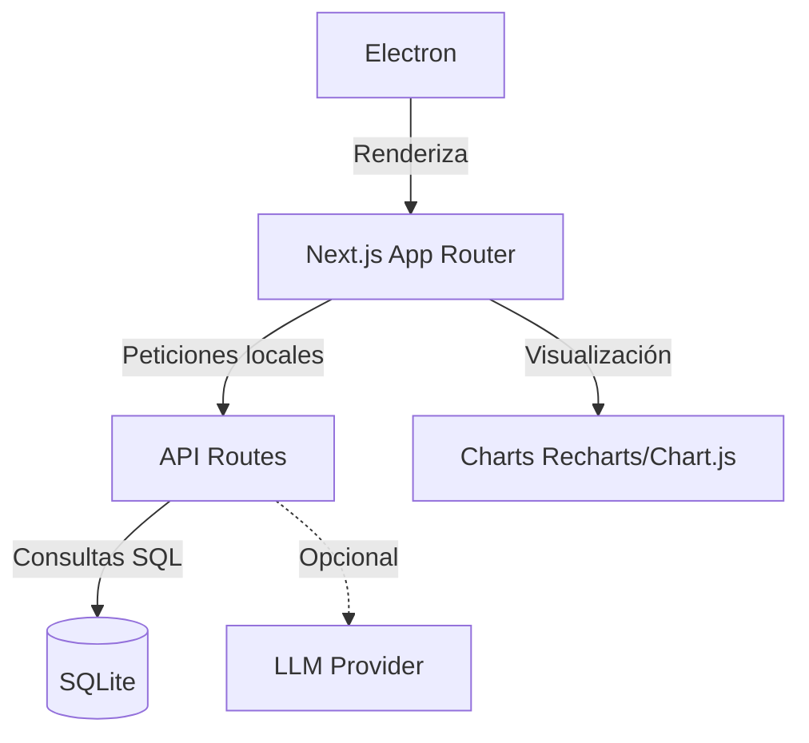

# 💸 FinTrack — Control Financiero Personal

<p align="center">
  
</p>

<p align="center">
  <strong>FinTrack is a privacy-first desktop application for personal finance management built with Electron, Next.js and SQLite.</strong>
</p>

<p align="center">
  <a href="https://github.com/iPiiix/FinTrack/releases/latest"></a>
  <a href="LICENSE"></a>
  
  
</p>

<p align="center">
  <a href="docs/index.md">Documentación</a> ·
  <a href="docs/getting-started.md">Primeros pasos</a> ·
  <a href="docs/features.md">Funcionalidades</a> ·
  <a href="docs/architecture.md">Arquitectura</a> ·
  <a href="docs/faq.md">FAQ</a> ·
  <a href="https://github.com/iPiiix/FinTrack/releases">Releases</a>
</p>

FinTrack es una app de escritorio para gestión de finanzas personales. Registra ingresos y gastos, analiza tu flujo de caja, visualiza tu patrimonio y obtén proyecciones con IA. Todo **100 % local**: los datos viven en tu dispositivo en SQLite. Sin suscripciones, sin registro, sin telemetría.

---

## Descarga

| Plataforma | Enlace |
|---|---|
| **macOS — Apple Silicon** | [FinTrack-1.0.0-arm64.dmg](https://github.com/iPiiix/FinTrack/releases/latest/download/FinTrack-1.0.0-arm64.dmg) |
| **macOS — Intel** | [FinTrack-1.0.0.dmg](https://github.com/iPiiix/FinTrack/releases/latest/download/FinTrack-1.0.0.dmg) |
| **Windows** | [FinTrack-Setup-1.0.0.exe](https://github.com/iPiiix/FinTrack/releases/latest/download/FinTrack-Setup-1.0.0.exe) |

> **Linux** — próximamente.

---

## Dimensión del Proyecto

- **~30** componentes React
- **63** endpoints de API
- **4** tablas principales (SQLite)
- **+90** commits

---

## Arquitectura



## Funcionalidades

### Libro mayor
Registra cada ingreso, gasto o transferencia con nombre, importe, categoría y cuenta. Historial completo con búsqueda y filtros por tipo.

### Flujo de caja
Gráfico mensual de capital entrante vs. gasto saliente con curva acumulada. Tasa de ahorro calculada al instante con indicador de salud (Excelente / Puede mejorar / Crítico).

### Gastos por categoría
Donut chart interactivo con desglose automático por categoría. Categorías predefinidas: Nómina, Vivienda, Alimentación, Transporte, Ocio — y puedes crear las tuyas.

### Portfolio
Registra acciones, crypto, inmuebles y liquidez en un único panel. Patrimonio neto calculado incluyendo todos los activos y cuentas.

### AI Advisor
Compatible con OpenAI, Anthropic, OpenRouter, LM Studio, Ollama.
El contexto enviado es configurable y nunca abandona el dispositivo salvo lo que el usuario decida compartir.

### Múltiples cuentas
Crea cuentas de distintos tipos (corriente, ahorro, inversión, efectivo) en cualquier divisa. El balance se actualiza en tiempo real.

### Exportación
Exporta tus transacciones a CSV desde el dashboard con un clic.

### 100 % local
SQLite almacenado en el directorio de datos del usuario. Sin servidores, sin cloud, sin telemetría. Tus datos no salen de tu equipo.

---

## Rendimiento y Benchmarks

- **Volumen:** Soporta más de 50.000 transacciones
- **Consulta media:** ~3 ms
- **Inicio de la aplicación:** ~0.8 s
- **Uso de RAM:** ~170 MB

---

## Seguridad

- ✔ SQL prepared statements
- ✔ JWT para sesiones locales
- ✔ CSP (Content Security Policy)
- ✔ XSS mitigation
- ✔ Input validation
- ✔ IPC isolation
- ✔ Electron contextIsolation
- ✔ Sandbox activado
- ✔ nodeIntegration disabled

---

## Tests

Configuración lista y preparada para garantizar estabilidad:
- **Playwright** para E2E testing
- **Vitest** para pruebas unitarias
- Cobertura de componentes críticos

---

## Stack técnico

| Capa | Tecnología |
|---|---|
| Shell de escritorio | Electron 42 |
| Framework web | Next.js 16 / React 19 / TypeScript |
| Base de datos | SQLite vía `better-sqlite3` |
| Estilos | Tailwind CSS v4 |
| Animaciones | Framer Motion |
| Gráficos | Chart.js + Recharts |
| Fondo 3D (landing) | Three.js / React Three Fiber |
| Autenticación local | JWT + auto-login sin pantalla de login |

---

## Desde el código fuente

Requisitos: **Node.js 18+**

```bash
git clone https://github.com/iPiiix/FinTrack.git
cd FinTrack/fintrack-web

npm install

# Modo desarrollo (Next.js + Electron juntos)
npm run dev:electron

# Solo el servidor web
npm run dev
```

Abre [http://localhost:3000](http://localhost:3000) para ver la landing, o la app Electron se abre sola con `dev:electron`.

### Compilar los instaladores

```bash
# macOS (genera .dmg en dist/)
npm run build:mac

# Windows (genera .exe en dist/)
npm run build:win
```

> Los binarios compilados van a `fintrack-web/dist/` y no se suben al repositorio. Las releases oficiales se publican en [GitHub Releases](https://github.com/iPiiix/FinTrack/releases).

---

## Estructura del repositorio

```
FinTrack/
├── fintrack-web/          # App principal (Next.js + Electron)
│   ├── app/               # Next.js App Router
│   │   ├── page.tsx       # Landing page (marketing)
│   │   ├── dashboard/     # Dashboard financiero
│   │   └── api/           # API Routes (SQLite local)
│   ├── electron/          # Main process de Electron
│   ├── components/        # Componentes compartidos
│   ├── lib/               # DB, JWT, utilidades
│   └── context/           # AuthContext (perfil local)
└── backend/               # FastAPI legacy (mantenido solo como referencia histórica)
```

*(Nota: El directorio `backend/` contiene código heredado en FastAPI. Actualmente, todo el backend productivo opera mediante API Routes de Next.js).*

---

## Cómo funciona el auto-login

Cuando Electron arranca, carga `/api/auth/auto-local`. Esta ruta crea el perfil local en la primera ejecución (usuario `local@fintrack.app`), emite las cookies JWT y redirige al dashboard — sin pantalla de login, sin contraseña. Los datos persisten en `~/Library/Application Support/FinTrack/fintrack.db` (macOS) o `%APPDATA%\FinTrack\fintrack.db` (Windows).

---

## Deploy de la landing page

La landing se puede desplegar en Vercel de forma independiente al binario de escritorio:

```bash
cd fintrack-web
npx vercel --prod
```

O conecta el repo en [vercel.com](https://vercel.com) y establece el **Root Directory** en `fintrack-web`. La variable `VERCEL=1` desactiva automáticamente el modo `standalone` de Next.js (que solo se usa para Electron).

---

## Licencia

MIT — úsalo, modifícalo, distribúyelo. Ver [LICENSE](LICENSE).

---

## Documentación completa

| | |
|---|---|
| [Primeros pasos](docs/getting-started.md) | Instalación, primer arranque, backup |
| [Funcionalidades](docs/features.md) | Guía detallada de cada módulo |
| [Arquitectura](docs/architecture.md) | Stack, esquema SQLite, flujos de datos |
| [Desarrollo](docs/development.md) | Build desde fuente, contribuir, variables de entorno |
| [FAQ](docs/faq.md) | Preguntas frecuentes |

---

<p align="center">
  Hecho con 🖤 por <a href="https://github.com/iPiiix">iPiiix</a>
</p>
